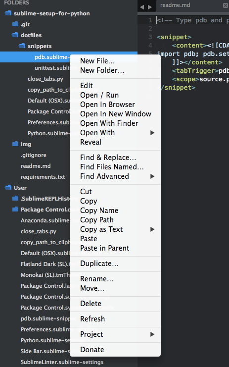

# Subl plugins

\*\*\*\*

### Keyboard Shortcuts

* **Goto Anything** Cmd+P is used for quickly finding and opening files. Just type in a part of a path and filename within a project and you can easily open that file. This is great for quickly opening files in large Django projects.
* **Goto Line Number** Ctrl+G takes you to a specific line number in an active file.
* **command + shift + p**  to open install package -&gt; search packages 

### SideBarEnhancements

[SideBarEnhancements](https://sublime.wbond.net/packages/SideBarEnhancements) extends the number of menu options in the sidebar, speeding up your overall workflow. Options such as **New File** and **Duplicate** are essential and should be part of ST3 out of the box. The **Delete** option alone makes it worth downloading. This feature simply sends files to the Trash, which may seem trivial, but if you delete a file without it, then it’s very difficult to recover unless you’re using a version control system

### Vintage Mode

enable vim mode on sublime

### Anaconda

[Anaconda](https://sublime.wbond.net/packages/Anaconda) is the ultimate Python package. It adds a number of IDE-like features to ST3 including the following:

* **Autocompletion** works by default, but there are a number of configuration [options](https://github.com/DamnWidget/anaconda#anaconda-autocompletion).
* **Code** [**linting**](http://en.wikipedia.org/wiki/Lint_%28software%29) uses either PyLint or PyFlakes with PEP 8. I personally use a different linting package, as I will explain shortly, so I disable linting altogether within the user-defined Anaconda settings file, **Anaconda.sublime-settings**, via the file menu: **Sublime &gt; Preferences &gt; Package Settings &gt; Anaconda &gt; Settings - User**: `{"anaconda_linting": false}`
* **McCabe code complexity checker** runs the [McCabe complexity checker](http://en.wikipedia.org/wiki/Cyclomatic_complexity) tool within a specific file. If you’re not familiar with what complexity is, be sure to visit the link above.
* **Goto Definitions** finds and displays the definition of any variable, function, or class throughout your entire project.
* **Find Usage** quickly searches where a variable, function, or class has been used in a specific file.
* **Show Documentation** shows the docstring for functions or classes \(if defined, of course\).

### SublimeLinter

[SublimeLinter](https://sublime.wbond.net/packages/SublimeLinter) is a framework for ST3 linters. The package itself does not include any actual linters; those must be installed separately via Package Control using the **SublimeLinter-\[linter\_name\]** naming syntax. You can view official linters [here](https://github.com/SublimeLinter). There are also a number of third party linters, which can be viewed in Package Control. Check out the installation instructions [here](http://sublimelinter.readthedocs.org/en/latest/installation.html).

### GitGutter

[GitGutter](https://sublime.wbond.net/packages/GitGutter) shows little icons in ST3’s gutter area that indicate whether a line has been inserted, modified, or deleted since the last commit.

### Markdown Preview

[Markdown Preview](https://sublime.wbond.net/packages/Markdown%20Preview) is used for previewing and building markdown files.

To use, open the Package Manager and type `Markdown Preview` to show the available commands:

* Markdown Preview: Python Markdown: Preview in Browser
* Markdown Preview: Python Markdown: Export HTML in Sublime Text
* Markdown Preview: Python Markdown: Copy to Clipboard
* Markdown Preview: GitHub Flavored Markdown: Preview in Browser
* Markdown Preview: GitHub Flavored Markdown: Export HTML in Sublime Text
* Markdown Preview: GitHub Flavored Markdown: Copy to Clipboard
* Markdown Preview: Open Markdown Cheat Sheet

